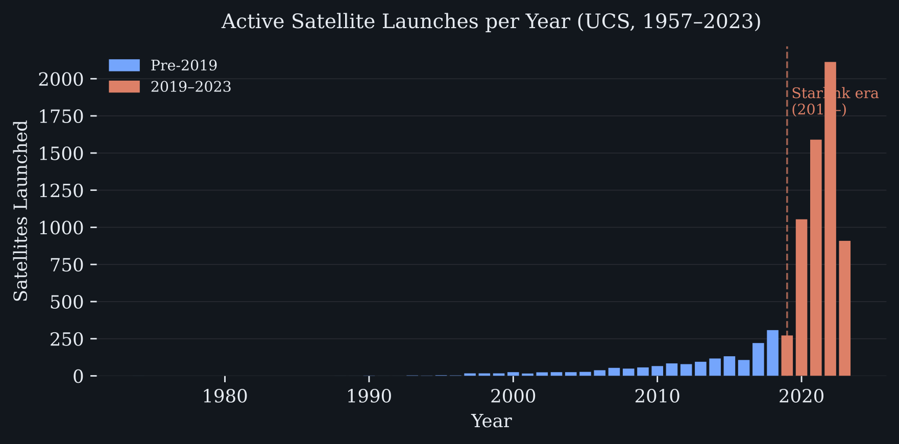

# Project of Data Visualization (COM-480)

| Student's name | SCIPER |
| -------------- | ------ |
|Vincent Fiszbin|394790|
|Philip Patrick Jan Hamelink|311769|
|Julien Schluchter|342745|

[Milestone 1](#milestone-1) • [Milestone 2](#milestone-2) • [Milestone 3](#milestone-3)

## Milestone 1 (20th March, 5pm)

# Space Oddities

A pdf version of the Milestone 1 report can be found [here](./Milestone%201%20Report.pdf)

*EPFL COM-480 Data Visualization*

---

## Acronyms
•⁠  ⁠*API*: Application Programming Interface
•⁠  ⁠*CDM*: Conjunction Data Message
•⁠  ⁠*GEO*: Geosynchronous / Geostationary Earth Orbit
•⁠  ⁠*LEO*: Low Earth Orbit
•⁠  ⁠*MEO*: Medium Earth Orbit
•⁠  ⁠*NORAD*: North American Aerospace Defense Command
•⁠  ⁠*RCS*: Radar Cross Section
•⁠  ⁠*SATCAT*: Satellite Catalog
•⁠  ⁠*SGP4*: Simplified General Perturbations 4
•⁠  ⁠*TCA*: Time of Closest Approach
•⁠  ⁠*TLE / 3LE*: Two-Line Element / Three-Line Element
•⁠  ⁠*UCS*: Union of Concerned Scientists

---

## Summary
This project, Space Oddities, explores the historical growth and current density of artificial objects in Earth's orbit. By combining metadata from the Union of Concerned Scientists with orbital elements from Space-Track and CelesTrak, we aim to visualize the risk of orbital congestion and the emergence of "mega-constellations" like Starlink. Our visualization will guide users from a historical overview of space launches to a visual mapping of collision risks in Low Earth Orbit (LEO).

---

## 1. Dataset

### 1.1 Data Sources
To ensure a comprehensive analysis, we will use three primary datasets:
1.⁠ ⁠*UCS Satellite Database*: A comprehensive registry detailing active satellites. It provides crucial metadata including ownership, country of origin, purpose, mass, and orbit class.
2.⁠ ⁠*Space-Track.org: Maintained by the US Space Command, this platform provides raw spatial data via Two-Line Elements (TLEs) for the entire catalog of tracked orbital objects, including active payloads and debris. It also publishes **Conjunction Data Messages (CDMs)*, automated alerts issued whenever two tracked objects are predicted to pass within a dangerous proximity threshold.
3.⁠ ⁠*CelesTrak*: Maintained by Dr. T. S. Kelso, this dataset serves as an external source to compare and augment TLEs results from Space-Track.

### 1.2 Quality & Preprocessing
The UCS database is highly structured but was last updated in May 2023, requiring careful synchronization with current orbital data. Both Space-Track and CelesTrak data are updated regularly and Space-Track requires parsing of TLE text formats.

*Table 1: Comparison of the main data providers used in the pipeline.*

| | UCS Database | Space-Track | CelesTrak |
| :--- | :--- | :--- | :--- |
| *Data Used* | Satellite metadata (ownership, purpose, mass, orbit class) | TLEs, SATCAT, CDMs | TLEs, SATCAT |
| *Update policy* | Last update in May 2023 | Regular update | Regular update |
| *Format* | Excel | Text / API | CSV |
| *Preprocessing* | Excel parsing, NORAD ID matching, handling missing values | TLE parsing, filtering, CDM event extraction | CSV parsing, NORAD ID matching |
| *Role in Pipeline* | Metadata enrichment | Primary operational data source for TLEs, SATCAT, CDMs | Secondary source for TLEs and SATCAT |

The UCS database contains 7,560 rows and 27 relevant columns; mass data is approximately 2% incomplete. Space-Track's full TLE catalog contains 68,107 entries. CelesTrak's SATCAT catalogs 68,147 tracked objects across 17 columns. It is possible to filter the data to retain only objects currently in orbit, for instance using decay-related fields. We will use Python libraries such as ⁠ Skyfield ⁠ or ⁠ SGP4 ⁠ to convert raw TLEs into metrics such as altitude, inclination, and semi-major axis. Using propagation, we can also use this data to estimate the position of satellites and their current orbit.

### 1.3 Conjunction Data Messages in Detail
A CDM is a structured alert issued by US Space Command whenever two tracked objects are projected to pass closer than a safety threshold. Each record contains the identities of both objects, the predicted miss distance at TCA, and a computed collision probability $P_{c}$. 

*Table 2: Real CDM example (Space-Track, issued 19 March 2026). $P_{c} > 10^{-4}$ is the standard industry threshold for elevated concern.*

| Field | Value | Meaning |
| :--- | :--- | :--- |
| ⁠ TCA ⁠ | 2026-03-22 16:17 UTC | Time of Closest Approach |
| ⁠ MIN_RNG ⁠ | 385 m | Predicted miss distance |
| ⁠ PC ⁠ | $5.6\times10^{-4}$ | Collision probability |
| ⁠ EMERGENCY_REPORTABLE ⁠ | Y | Exceeds reporting threshold |
| ⁠ SAT_1 ⁠ / ⁠ SAT1_OBJECT_TYPE ⁠ | GEOSAT (NORAD 15595) / PAYLOAD (LARGE RCS) | Active payload (US Navy) |
| ⁠ SAT_2 ⁠ / ⁠ SAT2_OBJECT_TYPE ⁠ | PSLV R/B (NORAD 39093) / ROCKET BODY (LARGE RCS) | Abandoned rocket body |

This is precisely the scenario our visualization aims to make tangible: two massive objects, neither of which can manoeuvre, converging to within a few hundred metres. A collision at these velocities would generate thousands of new debris fragments, each capable of triggering further collisions, the first step in the Kessler cascade.

---

## 2. Problematic

	⁠"The orbit of the Earth is a limited resource. As we place more and more objects into it, the probability of collisions will increase until the collision rate exceeds the rate of removal by atmospheric drag." — Donald J. Kessler

### 2.1 Topic & Main Axis
Our visualization explores the exponential growth of orbital objects, focusing on congestion and the threat of the "Kessler Syndrome". We aim to answer:
•⁠  ⁠*Where* is the highest density of objects currently located?
•⁠  ⁠*How* have mega-constellations altered the landscape of LEO?
•⁠  ⁠*What* are the current risks of collision, and how can we make a CDM, a raw table of numbers, visually meaningful to a non-expert?

	⁠*The Kessler Syndrome:* A theoretical scenario where the density of objects in LEO is high enough that collisions between objects cause a cascade of debris, potentially making specific orbits unusable for generations.

### 2.2 Motivation & Target Audience
With the commercial spaceflight boom, space sustainability has become a critical global issue. Our target audience includes the general public and policymakers who require an intuitive understanding of orbital density that raw data alone cannot provide. A CDM entry reporting $P_{c} = 5.6\times10^{-4}$ and a miss distance of 385 m means little to a non-specialist; our goal is to translate that into something visceral: two objects, their trajectories, and the shrinking gap between them.

---

## 3. Exploratory Data Analysis

### 3.1 Initial Statistics
Initial exploration reveals a space environment under growing stress. The UCS database catalogs 7,560 active satellites, of which 89.5% reside in LEO. Launch activity has grown dramatically: 2022 alone saw 2,113 new satellites, more than all launches before 2018 combined. The driving force is the deployment of mega-constellations such as Starlink, which now account for the majority of active LEO objects.

  
   
  <em>Figure 1: Satellites launched per year (UCS, 1957–2023). The Starlink era begins around 2019.</em>

### 3.2 Debris vs. Payloads
CelesTrak's SATCAT catalogs 68,147 total tracked objects since Sputnik. As shown in our initial visualisations, debris (35,749) outnumbers operational satellites (14,748) by 2.4:1. Rocket bodies add a further 6,820 objects. The orbit class breakdown confirms the extreme concentration in LEO.

  
  

  <em>Figure 2 & 3: Tracked objects by type and Orbit class distribution.</em>

---

## 4. Related Work

### 4.1 Existing Visualization Projects
The landscape of orbital visualization is dominated by two extremes: real-time tracking and professional monitoring. Stuff in Space provides a technically impressive 3D WebGL environment showing real-time positions of all tracked objects. However, it functions more as a digital twin than a narrative tool, lacking context for the average user. On the professional side, LeoLabs offers high-fidelity conjunction monitoring, but its interface is designed for satellite operators, making the data's gravity difficult for the public to grasp.

### 4.2 Originality & Inspiration
Our project bridges the gap between raw spatial data and public awareness through a narrative-driven approach. Unlike existing tools that plot 3D points, we will:
•⁠  ⁠*Visualize the "Invisible" Risk:* By integrating Conjunction Data Messages (CDMs), we move beyond showing where things are to showing where they might collide.
•⁠  ⁠*Contextualize Mega-Constellations:* We will specifically highlight the impact of the "Starlink era" on orbital density.
•⁠  ⁠*Humanize the Scale:* We translate abstract distances (e.g., a 385m miss distance) into visceral comparisons to make the danger of the Kessler Syndrome tangible.

### 4.3 Visual Inspiration
To bridge the gap between complex orbital mechanics and intuitive storytelling, we draw inspiration from premier data journalism and space agencies:

•⁠  ⁠*Narrative Scrollytelling (The Pudding):* We look to The Pudding as a structural benchmark for scrollytelling. Their ability to guide users through complex datasets step-by-step is essential for preventing "data overwhelm" when visualizing the 68,147 objects currently tracked in CelesTrak's SATCAT.
  * Reference: ⁠ https://pudding.cool/2017/10/satellites/ ⁠
•⁠  ⁠*Layered Visual Language (Information is Beautiful):* To represent the diverse populations of orbital objects—including the 2.4:1 ratio of debris to operational satellites—we adapt the dense, layered aesthetic popularized by Information is Beautiful. This style allows for a clear comparison of mass and purpose across thousands of data points.
  * Reference: ⁠ https://informationisbeautiful.net ⁠ / ⁠ https://satellitecharts.xyz ⁠
•⁠  ⁠*From Discrete Points to Orbital Density (ESA):* We take inspiration from the ESA Space Debris Office and their use of spatial density maps. Rather than rendering satellites as isolated dots, which can be misleading at a global scale, we aim to visualize "orbital highways" as continuous regions of varying density. This approach effectively illustrates how the extreme concentration in LEO (89.5% of active satellites) creates "stressed" environments where the risk of the Kessler Syndrome becomes a visible reality.

  
   
  <em>Figure 4: Spatial density of objects by orbital altitude (ESA).</em>

  * Reference: ⁠ https://www.esa.int/ESA_Multimedia/Images/2019/10/Spatial_density_of_objects_by_orbital_altitude ⁠

---

## References
•⁠  ⁠*Union of Concerned Scientists (2023).* UCS Satellite Database. Comprehensive public registry of active satellites.
•⁠  ⁠*US Space Command (2026).* Space-Track.org: The Source for Space Surveillance Data. Official repository for TLE and CDM data.
•⁠  ⁠*Kelso, T. S. (2026).* CelesTrak: Satellite Catalog (SATCAT). Curated orbital data and analytics for space enthusiasts.
•⁠  ⁠*Kessler, Donald J. and Burton G. Cour-Palais (1978).* 'Collision Frequency of Artificial Satellites: The Creation of a Debris Belt'. Journal of Geophysical Research: Space Physics 83.A6, pp. 2637-2646.
•⁠  ⁠*Yoder, James (2026).* Stuff in Space. Real-time 3D visualization of objects in Earth orbit.
•⁠  ⁠*LeoLabs (2026).* LeoLabs Space Domain Awareness Platform. Commercial visualization for collision avoidance and tracking.
